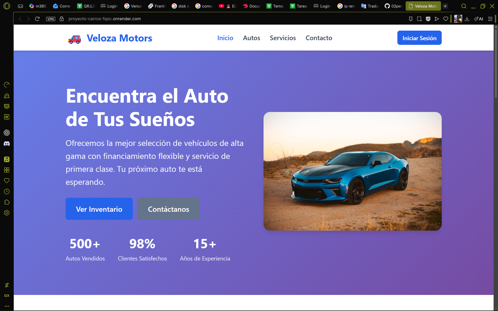
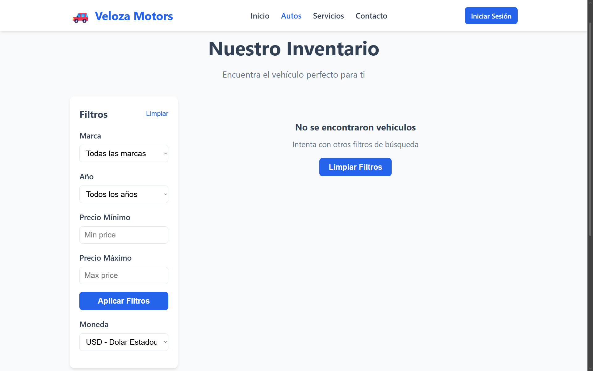
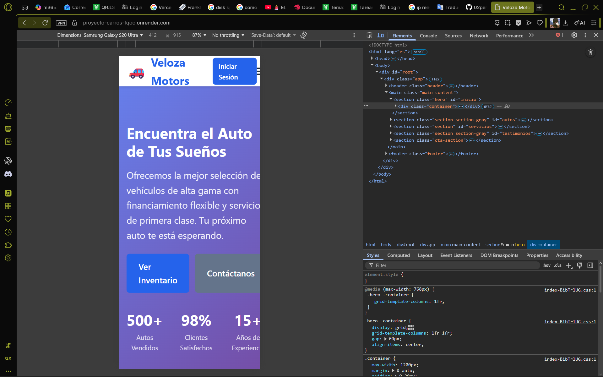
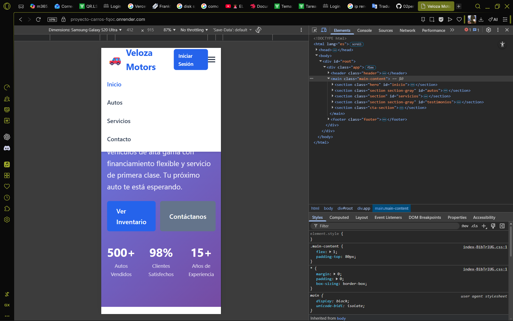
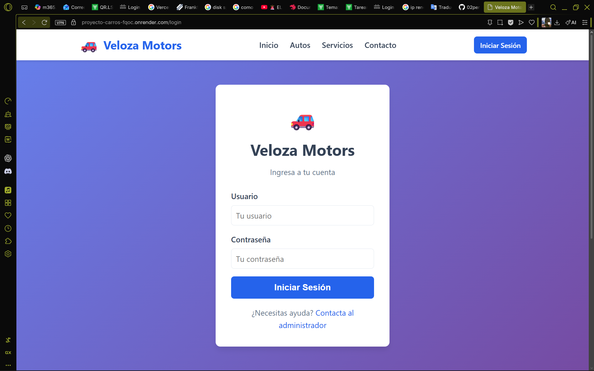

# Veloza Motors

[](https://github.com/02peri-ops/Proyecto-Carros)
[](LICENSE)
[](https://nodejs.org/)
[](https://reactjs.org/)
[](https://expressjs.com/)

Aplicacion web full-stack para la gestion integral de una agencia de automoviles con inventario, panel de administracion, autenticacion de usuarios y servicios de conversion de divisas.

---

## Tabla de Contenidos

1. [Descripcion](#descripcion)
2. [Caracteristicas Principales](#caracteristicas-principales)
3. [Tecnologias](#tecnologias)
4. [Instalacion](#instalacion)
5. [Uso](#uso)
6. [Estructura del Proyecto](#estructura-del-proyecto)
7. [API Endpoints](#api-endpoints)
8. [Contribucion](#contribucion)
9. [Licencia](#licencia)
10. [Capturas de Pantalla](#capturas-de-pantalla)

---

## Descripcion

Veloza Motors es una aplicacion web full-stack disenada para la gestion integral de una agencia de automoviles. El proyecto incluye un sistema completo de gestion de inventario de vehiculos, panel de administracion, autenticacion de usuarios con JWT, y servicios de conversion de divisas en tiempo real mediante la API de Frankfurter.

Esta aplicacion permite a los administradores gestionar el catalogo de vehiculos (crear, leer, actualizar y eliminar), mientras que los clientes pueden explorar el inventario, comparar vehiculos, ver detalles completos y contactar a la agencia.

---

## Caracteristicas Principales

| # | Caracteristica | Descripcion |
|---|----------------|-------------|
| 1 | Catalogo de Vehiculos | Exploracion completa del inventario de automoviles con filtros y busqueda |
| 2 | Detalles de Vehiculo | Informacion detallada de cada vehiculo incluyendo especificaciones tecnicas |
| 3 | Sistema de Autenticacion | Login seguro con JWT para administradores y usuarios |
| 4 | Panel de Administracion | Gestion completa del inventario (CRUD completo) |
| 5 | Comparacion de Vehiculos | Comparar hasta 4 vehiculos lado a lado |
| 6 | Conversion de Divisas | Integracion con API de tipos de cambio en tiempo real |
| 7 | Formulario de Contacto | Sistema de contacto para consultas de clientes |
| 8 | Sistema de Notificaciones | Retroalimentacion en tiempo real para el usuario |
| 9 | Diseno Responsivo | Optimizado para dispositivos moviles y escritorio |

---

## Tecnologias

### Frontend
- **React** - Biblioteca de JavaScript para interfaces de usuario
- **Vite** - Herramienta de compilacion rapida
- **React Router** - Enrutamiento para aplicaciones React
- **Axios** - Cliente HTTP para llamadas a la API

### Backend
- **Node.js** - Entorno de ejecucion de JavaScript
- **Express** - Framework web para Node.js
- **MongoDB** - Base de datos NoSQL
- **Mongoose** - ODM para MongoDB

### Seguridad
- **JWT** - Tokens web JSON para autenticacion
- **Bcrypt** - Biblioteca de hash de contrasenas

---

## Instalacion

### Prerrequisitos

- **Node.js** version 14.0.0 o superior
- **npm** o **yarn**
- **MongoDB** (instancia local o MongoDB Atlas)

### Pasos de Instalacion

```bash
# 1. Clonar el repositorio
git clone https://github.com/02peri-ops/Proyecto-Carros.git
cd Proyecto-Carros

# 2. Instalar dependencias del backend
npm install

# 3. Instalar dependencias del frontend
cd frontend
npm install

# 4. Regresar al directorio raiz
cd ..

# 5. Configurar variables de entorno
# Copia el archivo .env.example y renominalo a .env
cp src/.env.example .env

# 6. Edita el archivo .env con tu configuracion
# (Ver seccion de configuracion de variables de entorno)

# 7. (Opcional) Instalar todo con un solo comando
npm run install:all
```

### Configuracion de Variables de Entorno

Crea un archivo `.env` en la raiz del proyecto con las siguientes variables:

```env
# Puerto del servidor
PORT=3000

# URI de MongoDB
DB_URI=mongodb://localhost:27017/veloza_motors

# Clave secreta para JWT (genera una cadena aleatoria segura)
JWT_SECRET=tu_clave_secreta_aqui

# Entorno (development o production)
NODE_ENV=development
```

---

## Uso

### Desarrollo

```bash
# Iniciar el backend (desde la raiz del proyecto)
npm run dev

# En otra terminal, iniciar el frontend
cd frontend
npm run dev
```

La aplicacion estara disponible en:
- **Frontend:** http://localhost:5173
- **API:** http://localhost:3000/api

### Produccion

```bash
# 1. Construir el frontend para produccion
npm run build:frontend

# 2. Iniciar el servidor en modo produccion
npm start
```

### Pruebas

```bash
# Ejecutar pruebas
npm test
```

---

## Estructura del Proyecto

```
Proyecto-Carros/
|
|-- src/                      # Backend (Node.js/Express)
|   |-- config/               # Configuracion de base de datos
|   |   |-- db.js            # Conexion a MongoDB
|   |-- middlewares/         # Middlewares de Express
|   |   |-- auth.js          # Autenticacion JWT
|   |   |-- errorHandler.js  # Manejo de errores
|   |   |-- role.js          # Control de roles
|   |   |-- validateCars.js  # Validacion de datos
|   |-- models/              # Modelos de Mongoose
|   |   |-- cars.js          # Modelo de vehiculos
|   |   |-- user.js          # Modelo de usuarios
|   |-- routes/             # Rutas de la API
|   |   |-- auth.routes.js   # Rutas de autenticacion
|   |   |-- car.routes.js    # Rutas de vehiculos
|   |   |-- exchange.routes.js # Rutas de divisas
|   |-- services/           # Servicios externos
|   |   |-- exchangeRate.service.js
|   |-- tests/              # Pruebas unitarias
|   |   |-- auth.test.js
|   |-- app.js              # Punto de entrada del servidor
|
|-- frontend/                # Frontend (React/Vite)
|   |-- src/
|   |   |-- components/     # Componentes reutilizables
|   |   |   |-- CarCard.jsx    # Tarjeta de vehiculo
|   |   |   |-- Header.jsx     # Encabezado
|   |   |   |-- Footer.jsx     # Pie de pagina
|   |   |   |-- Notifications.jsx
|   |   |-- pages/          # Paginas de la aplicacion
|   |   |   |-- Home.jsx       # Pagina principal
|   |   |   |-- Cars.jsx       # Catalogo de vehiculos
|   |   |   |-- CarDetail.jsx  # Detalle de vehiculo
|   |   |   |-- Services.jsx   # Servicios
|   |   |   |-- Contact.jsx    # Contacto
|   |   |   |-- Login.jsx      # Inicio de sesion
|   |   |   |-- AdminDashboard.jsx
|   |   |-- App.jsx           # Componente principal
|   |   |-- main.jsx          # Punto de entrada
|   |   |-- index.css         # Estilos globales
|   |-- package.json
|   |-- vite.config.js
|
|-- data/                   # Datos estaticos
|   |-- Cars_Stock.Cars.json  # Inventario de ejemplo
|
|-- package.json            # Dependencias del proyecto
|-- render.yaml             # Configuracion de despliegue
|-- README.MD               # Este archivo
```

---

## API Endpoints

### Autenticacion

| Metodo | Endpoint | Descripcion | Autenticacion |
|--------|----------|-------------|---------------|
| POST | /api/auth/register | Registrar nuevo usuario | No |
| POST | /api/auth/login | Iniciar sesion | No |

### Vehiculos

| Metodo | Endpoint | Descripcion | Autenticacion |
|--------|----------|-------------|---------------|
| GET | /api/cars | Obtener todos los vehiculos | No |
| GET | /api/cars/:id | Obtener vehiculo por ID | No |
| POST | /api/cars | Crear nuevo vehiculo | Si (Admin) |
| PUT | /api/cars/:id | Actualizar vehiculo | Si (Admin) |
| DELETE | /api/cars/:id | Eliminar vehiculo | Si (Admin) |

### Tipos de Cambio

| Metodo | Endpoint | Descripcion | Autenticacion |
|--------|----------|-------------|---------------|
| GET | /api/exchange/rate?from=USD&to=MXN | Obtener tasa de cambio | No |

---

## Contribucion

Las contribuciones son bienvenidas. Por favor, sigue estos pasos:

1. **Fork** el repositorio
2. Crea una rama para tu funcionalidad (`git checkout -b feature/nueva-funcionalidad`)
3. **Commit** tus cambios (`git commit -m 'Agregar nueva funcionalidad'`)
4. **Push** a la rama (`git push origin feature/nueva-funcionalidad`)
5. Abre un **Pull Request**

### Guias de Contribucion

- Manten el codigo limpio y bien documentado
- Sigue las convenciones de naming del proyecto
- Agrega pruebas para nuevas funcionalidades
- Actualiza la documentacion segun sea necesario

---

## Capturas de Pantalla

### Pagina de Inicio



---

### Catalogo de Vehiculos



---

### Detalle del Vehiculo

> **NOTA:** Reemplaza esta seccion con tu captura de pantalla real.
>
> **Tamano recomendado:** 1200x800 px (ancho completo) o 800x500 px (responsivo)
>
> **Formato:** PNG o JPG con compresion moderada
>
> **Nombre sugerido:** screenshot-car-detail.png

```
+-----------------------------------------------------------------------+
|                                                                       |
|   +===============================================================+   |
|   |                                                               |   |
|   |                                                               |   |
|   |              [INSERTAR CAPTURA DE PANTALLA AQUI]             |   |
|   |                                                               |   |
|   |         +------------------------------------------+          |   |
|   |         |                                          |          |   |
|   |         |    Captura de: Detalle del Vehiculo      |          |   |
|   |         |                                          |          |   |
|   |         |    - Imagen principal del vehiculo       |          |   |
|   |         |    - Informacion general (marca, modelo)|          |   |
|   |         |    - Especificaciones tecnicas           |          |   |
|   |         |    - Precio y conversion de divisas      |          |   |
|   |         |    - Descripcion completa               |          |   |
|   |         |                                          |          |   |
|   |         +------------------------------------------+          |   |
|   |                                                               |   |
|   +===============================================================+   |
|                                                                       |
+-----------------------------------------------------------------------+
```

---

### Panel de Administracion

> **NOTA:** Reemplaza esta seccion con tu captura de pantalla real.
>
> **Tamano recomendado:** 1200x800 px (ancho completo) o 800x500 px (responsivo)
>
> **Formato:** PNG o JPG con compresion moderada
>
> **Nombre sugerido:** screenshot-admin.png

```
+-----------------------------------------------------------------------+
|                                                                       |
|   +===============================================================+   |
|   |                                                               |   |
|   |                                                               |   |
|   |              [INSERTAR CAPTURA DE PANTALLA AQUI]             |   |
|   |                                                               |   |
|   |         +------------------------------------------+          |   |
|   |         |                                          |          |   |
|   |         |    Captura de: Panel de Administracion   |          |   |
|   |         |                                          |          |   |
|   |         |    - Tabla de gestion de vehiculos        |          |   |
|   |         |    - Opciones de editar y eliminar        |          |   |
|   |         |    - Formulario para agregar vehiculos   |          |   |
|   |         |    - Estadisticas del inventario          |          |   |
|   |         |                                          |          |   |
|   |         +------------------------------------------+          |   |
|   |                                                               |   |
|   +===============================================================+   |
|                                                                       |
+-----------------------------------------------------------------------+
```

---

### Diseno Responsivo (Movil)





---

### Inicio de Sesion




---

## Creditos

Desarrollado por:

- **Gilberto Ruiz** - *Desarrollador Full Stack* - [GitHub](https://github.com/02peri-ops)

- **Diana Gonzales** - *Desarrolladora Full Stack* - [GitHub](https://github.com/DianaGlzA)

- **Samuel Esquivel** - *Desarrollador Full Stack* - [GitHub](https://github.com/Sam-Is-noDev1)


---

## Contacto

Para preguntas, sugerencias o soporte, por favor contacta a:

- **Repositorio GitHub:** [https://github.com/02peri-ops/Proyecto-Carros](https://github.com/02peri-ops/Proyecto-Carros)
- **Sitio Web:** [https://veloza-motors.onrender.com](https://proyecto-carros-fqoc.onrender.com)

---

<div align="center">

Si te gusta este proyecto, no olvides darle una estrella en GitHub.

Hecho con MERN

</div>

---

*Ultima actualizacion: 2026*
